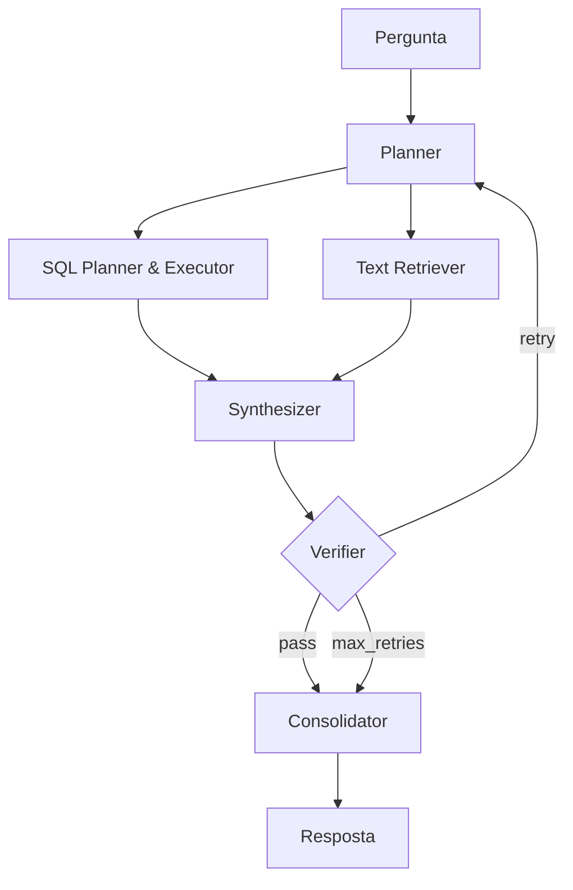

# experimentos

Implementação final da arquitetura multiagente para recuperação híbrida de informação. Combina dados estruturados (SQL/SQLite) e não estruturados (documentos indexados no ChromaDB) através de um pipeline LangGraph, com suíte completa de avaliação por múltiplos juízes LLM e análises estatísticas.

Esta é a evolução da PoC descrita no Capítulo 4 do projeto de qualificação, mantém os módulos centrais validados na PoC (roteamento, recuperação SQL, recuperação textual, síntese) e adiciona os módulos **Verifier** e **Consolidator**, além de evoluir o **Router** para um **Planner** com decomposição explícita de tarefas. Ver [Considerações Parciais do projeto](../README.md) para motivação das evoluções.

> Para visão geral do projeto, contexto acadêmico, autoria, seção sobre uso de IA e como citar, ver o [README do monorepo](../README.md).

## 1. Visão geral

O sistema roteia uma pergunta em linguagem natural por um planejador que decide quais estratégias de recuperação ativar (estruturada, textual ou híbrida), coleta evidências, sintetiza uma resposta coerente com citações às fontes, verifica a consistência contra as evidências recuperadas e consolida o resultado final. Todos os componentes são substituíveis via variáveis de ambiente, e **modos de ablação** permitem isolar a contribuição de cada estágio na avaliação empírica.

### Arquitetura

Pipeline completo (modo `full`). O Verifier pode acionar um *retry* devolvendo o controle ao Planner com novas instruções de busca, ou prosseguir para o Consolidator quando a resposta atende aos critérios de fidelidade.



> O Mermaid renderizado pelo LangGraph para qualquer modo pode ser obtido com `uv run rag graph --ablation <modo>`.

### Nós do pipeline

| Nó | Descrição |
|---|---|
| Planner | Decompõe a pergunta em sub-tarefas especializadas e decide quais caminhos de recuperação ativar (S/NS/H) |
| SQL Planner & Executor | Gera e executa SQL sobre Banco de Dados relacional, com retry em caso de erro de execução |
| Text Retriever | Busca por similaridade nos embeddings dos documentos em Banco de Dados vetorial |
| Synthesizer | Combina evidências das rotas em uma resposta provisória, associando cada trecho a citações explícitas |
| Verifier | Verifica a sustentação das sentenças pelas evidências (inspirado em RARR); pode reescrever trechos ou solicitar busca complementar |
| Consolidator | Reformula a resposta em linguagem acessível, preservando a fidelidade às fontes |

### Modos de ablação

Os modos permitem medir a contribuição isolada de cada componente à qualidade da resposta final. Os nomes correspondem às arquiteturas usadas no Capítulo de Resultados da dissertação.

| Modo (CLI) | Nome no trabalho | Pipeline | O que isola |
|---|---|---|---|
| `full` | Completa | Planner → SQL/Text → Synthesizer → Verifier → Consolidator | Baseline — pipeline completo |
| `no-verifier` | Sem Verificação | Planner → SQL/Text → Synthesizer → Consolidator | Contribuição do Verifier + laço de retry |
| `no-synthesizer` | Sem Síntese | Planner → SQL/Text → ConsolidatorLite | Contribuição do Synthesizer estruturado (segments + rationale + citações) |
| `poc` | Simples | SimpleRouter → SQL/Text → SimpleSynthesizer | Reimplementação da PoC do Cap. 4 do projeto, com retry de SQL e padrão de citação |

Comparações limpas:

- **Completa vs Sem Verificação** — isola o Verifier.
- **Sem Verificação vs Sem Síntese** — isola o Synthesizer estruturado (o LLM final muda de formato, mas continua sendo um LLM de síntese).
- **Sem Síntese vs Simples** — isola o Planner LLM (decomposição em sub-tarefas vs `simple_router` classificador).

---

## 2. Requisitos

- Python 3.11+
- [`uv`](https://docs.astral.sh/uv/)
- Chave(s) de API para pelo menos um provedor de LLM (OpenAI, Gemini, Groq, OpenRouter ou Ollama local)
- Chave separada (recomendado) para o provedor do juiz LLM usado na avaliação
- **Dataset** com a base utilizada no trabalho (ver seção _Reprodução_ abaixo)

---

## 3. Reprodução dos experimentos da dissertação

### 3.1. Obter o dataset

Clonar o repositório do dataset e posicionar os arquivos brutos em `experimentos/data/raw/` — o comando `rag ingest` se encarrega de processá-los nas etapas seguintes.

```bash
# 1. Clonar o dataset repo
git clone git@github.com:z-fab/agro-rag-dataset.git /tmp/agro-rag-dataset

# 2. Copiar CSVs e PDFs para data/raw/ (serão consumidos pelo Ingest)
mkdir -p data/raw/structured data/raw/unstructured
cp /tmp/agro-rag-dataset/data/structured/csv/*.csv    data/raw/structured/
cp /tmp/agro-rag-dataset/data/unstructured/pdfs/*.pdf data/raw/unstructured/

# 3. Copiar o benchmark de avaliação
cp /tmp/agro-rag-dataset/data/benchmark/evaluation.json data/evaluation.json

# 4. Copiar os schemas semânticos pré-gerados
#    (ou pular este passo e gerá-los a partir dos dados — ver §3.5)
cp /tmp/agro-rag-dataset/schemas/structured.yaml      data/structured.yaml
cp /tmp/agro-rag-dataset/schemas/unstructured.yaml    data/unstructured.yaml
```

A estrutura completa, formatos dos arquivos e a documentação do benchmark ficam no próprio [`Agro-RAG Dataset`](https://github.com/z-fab/agro-rag-dataset).

### 3.2. Instalar dependências

```bash
uv sync
```

### 3.3. Configurar `.env`

Copiar `.env.example` para `.env` e preencher as credenciais. Existem três eixos de configuração independentes:

1. **LLM de inferência** — provedor que executa os nós do grafo (Planner, SQL, Synthesizer, Verifier, Consolidator). Configurado por `PROVIDER` + `<PROVIDER>_API_KEY` + `<PROVIDER>_MODEL`. Pode ser sobrescrito por nó (ver §5).
2. **Embeddings** — provedor para o índice vetorial. Independente do LLM de inferência. Configurado por `EMBEDDING_PROVIDER` + `EMBEDDING_MODEL`.
3. **Juízes LLM** — usados pela suíte de avaliação. A dissertação adota **3 juízes independentes** com agregação por voto majoritário. Os três são configurados em conjunto:

```dotenv
# LLM de inferência (qualquer um dos providers suportados)
PROVIDER=openai
OPENAI_API_KEY=sk-...
OPENAI_MODEL=gpt-5-mini

# Embeddings
EMBEDDING_PROVIDER=openai
EMBEDDING_MODEL=text-embedding-3-small

# Juízes (J1 obrigatório; J2 e J3 opcionais — sem eles a triangulação não roda)
JUDGE_PROVIDER=openai
JUDGE_MODEL=gpt-5
JUDGE_PROVIDER_2=gemini
JUDGE_MODEL_2=gemini-2.5-pro
JUDGE_PROVIDER_3=openrouter
JUDGE_MODEL_3=qwen/qwen-2.5-72b-instruct
```

Apenas as credenciais dos providers que você for de fato usar precisam estar preenchidas. Providers suportados: OpenAI, Google Gemini, Groq, OpenRouter e Ollama (ver `src/config/providers.py`).

### 3.4. Ingestão (estruturada + não estruturada)

Um único comando processa as duas modalidades:

```bash
uv run rag ingest
```

Esse comando:

- **Estruturada** — lê os CSVs de `data/raw/structured/` e grava uma tabela por arquivo no SQLite `data/dados.db` (usando polars).
- **Não estruturada** — processa os PDFs de `data/raw/unstructured/` com [Docling](https://github.com/docling-project/docling), faz *chunking* em dois estágios (por cabeçalho e por tamanho) e armazena os embeddings em `data/chroma_db/` usando o provider configurado em `EMBEDDING_PROVIDER` / `EMBEDDING_MODEL` no `.env`.

### 3.5. (Opcional) Regenerar os schemas semânticos

Se você não copiou os YAMLs pré-gerados do dataset repo, ou quer regenerá-los a partir dos seus próprios dados ingeridos, rode:

```bash
uv run rag semantic-map
```

Gera `data/structured.yaml` (resumo de cada tabela SQL com estatísticas) e `data/unstructured.yaml` (catálogo dos PDFs indexados com tópicos e resumo) usando um LLM para produzir descrições em linguagem natural. Exige `data/dados.db` e `data/chroma_db/` prontos (i.e., após §3.4).

> Para plugar o pipeline em outro corpus, basta substituir os dados em `data/raw/` e regerar os schemas com este comando.

### 3.6. Rodar uma avaliação

```bash
# Arquitetura completa com o modelo default do .env
uv run rag eval --ablation full --run-id meu-teste

# Um modo de ablação específico
uv run rag eval --ablation no-verifier

# Paralelismo (atenção aos rate limits do provedor)
uv run rag eval -c 4
```

Saídas são gravadas em `data/outputs/<provider>_<model>/`:

- `snapshot_...json` — estados completos de cada item (prompts, evidências, respostas intermediárias)
- `results_...json` — métricas agregadas da execução
- `checkpoint_...json` — ponto de retomada (ignorado pelo git)

### 3.7. Julgamento LLM

O `rag eval` já invoca o juiz primário (J1) como parte do loop, seguindo a abordagem LLM-as-a-Judge. Para aumentar a robustez, a dissertação usa **três juízes independentes** (J1, J2, J3) agregados por voto majoritário.

O comando `rag rejudge` aplica os juízes configurados sobre snapshots já gravados — útil para acrescentar J2/J3 a posteriori, ou para reaproveitar snapshots de uma execução antiga após reconfigurar os juízes. É **idempotente**: se um item já tem julgamento de algum dos juízes (`j1`, `j2`, `j3`), aquele juiz é pulado para aquele item; só os juízes faltantes são chamados. Pode ser rodado quantas vezes for necessário.

Os juízes vêm das variáveis `JUDGE_PROVIDER`/`JUDGE_MODEL`, `JUDGE_PROVIDER_2`/`JUDGE_MODEL_2`, `JUDGE_PROVIDER_3`/`JUDGE_MODEL_3` no `.env`. Para escolher qual juiz será chamado sem rodar os outros, basta deixar os pares correspondentes vazios no `.env`.

```bash
# Migração de snapshots em formato legado (sem chamar LLMs)
uv run rag rejudge --migrate-only

# Aplicar todos os juízes configurados a todos os snapshots em data/outputs/
uv run rag rejudge

# Apenas um snapshot específico, com paralelismo
uv run rag rejudge --snapshot data/outputs/gpt/snapshot_full_<id>.json -c 5

# Smoke test: só os primeiros N itens de cada snapshot (sem gravar)
uv run rag rejudge --limit 1 --dry-run
```

Para inspecionar quais snapshots já têm os 3 juízes completos:

```bash
uv run rag status            # só incompletos
uv run rag status --all      # tudo
```

### 3.8. Análises estatísticas

```bash
uv run rag analyze
```

Gera, em `data/outputs/_analysis/`:

- `aggregated.csv` — uma linha por item julgado (modelo × arquitetura × pergunta), com dimensões dos juízes e métricas de execução
- `aggregated_runs.csv` — uma linha por execução (modelo × arquitetura), com agregados via `eval/metrics.py`
- `stats.json` — saída completa dos testes (Friedman, Wilcoxon de postos sinalizados, McNemar exato, κ quadrático, ICC, concordância entre juízes)
- `stats_summary.txt` — versão textual dos mesmos testes para leitura rápida
- `qualitative_samples.md` — recortes qualitativos (erros de SQL, retries, divergências Completa vs Simples, hipóteses de alucinação) para apoiar a redação do texto

A geração de figuras é feita externamente, a partir dos CSVs e JSONs acima, conforme a redação da dissertação.

### 3.9. Experimentos adicionais

Além das quatro arquiteturas avaliadas em `rag eval`, dois experimentos complementares aprofundam aspectos específicos da dissertação:

#### Experimento 1 — Verifier signal-only

Avalia a utilidade do **sinal do Verifier como classificador post-hoc de qualidade**, sem o custo do laço de retry. Sobre cada resposta produzida na arquitetura `no-verifier`, o Verifier é invocado uma única vez (sem retry) e suas features (`overall_pass`, `pct_supported`, `n_missing_aspects`, etc.) são correlacionadas com a quality dos juízes via Spearman e AUC-ROC.

```bash
# Coleta o sinal do Verifier sobre snapshots no-verifier existentes (idempotente)
uv run rag exp-verifier-signal

# Gera os CSVs de análise (Spearman, AUC, latência adicional)
uv run python -m scripts.analyze_verifier_signal
```

Saídas em `data/outputs/_analysis/`: `verifier_signal_summary.csv`, `verifier_signal_by_model.csv`, `verifier_signal_auc.csv`, `verifier_signal_auc_by_model.csv`.

#### Experimento 2 — Heterogeneidade de modelos por estágio (mix de tamanhos)

Investiga se vale a pena **misturar modelos de tamanhos diferentes em estágios diferentes do pipeline** (ex.: Planner grande, SQL pequeno, Synthesizer pequeno). Roda um delineamento factorial 2³ × 3 famílias (18 configs mistas + 6 baselines) sobre a arquitetura `no-synthesizer`. Cada configuração é executada via override de `<NODE>_PROVIDER` / `<NODE>_MODEL` (ver §5).

Exemplo de uma das configurações (Planner grande, SQL e Synth pequenos na família GPT):

```bash
PLANNER_PROVIDER=openai    PLANNER_MODEL=gpt-5 \
SQL_PROVIDER=openai        SQL_MODEL=gpt-5-nano \
SYNTHESIS_PROVIDER=openai  SYNTHESIS_MODEL=gpt-5-nano \
uv run rag eval --ablation no-synthesizer --run-id mix-gpt-LSS \
    --output-dir data/outputs/_mix/gpt/LSS
```

Após rodar todas as 18 configs nas três famílias:

```bash
uv run python -m scripts.analyze_mix_sizes
```

Saídas em `data/outputs/_analysis/`: `mix_sizes_raw.csv`, `mix_sizes_summary.csv`, `mix_sizes_effects.csv`, `mix_sizes_wilcoxon_vs_lll.csv` (efeitos principais por estágio, pooled, e Wilcoxon pareado contra o baseline LLL).

---

## 4. Referência da CLI

Todos os comandos são executados com `uv run rag <cmd>`.

| Comando | Descrição |
|---|---|
| `ingest` | Ingestão de dados estruturados (SQL) e não-estruturados (PDF→embeddings) |
| `semantic-map` | Gera os arquivos `structured.yaml` / `unstructured.yaml` a partir dos dados brutos |
| `chat [pergunta]` | Chat interativo ou one-shot (`--ablation`, `--verbose`) |
| `eval` | Avaliação em massa (ver `--help` para todas as flags) |
| `rejudge` | Re-julgamento idempotente sobre snapshots existentes (J1/J2/J3 do `.env`) |
| `status` | Reporta status de julgamento (j1/j2/j3) de todos os snapshots |
| `exp-verifier-signal` | Verifier post-hoc sobre snapshots `no-verifier` |
| `analyze` | Gera agregados, estatísticas e mineração qualitativa |
| `report` | Tabela textual a partir de `results_*.json` |
| `graph` | Visualização Mermaid do grafo |

---

## 5. Configuração por provedor e por nó

Os três eixos — LLM de inferência, embedding e juiz — são independentes. Para experimentos com **modelos diferentes por nó** (mix factorial), defina variáveis `<NODE>_PROVIDER` / `<NODE>_MODEL` no ambiente antes de chamar `rag eval`. Chaves suportadas: `PLANNER`, `SQL`, `SYNTHESIS`, `VERIFIER`, `ROUTER`.

Exemplo (Planner grande, SQL e Synthesis pequenos):

```bash
PLANNER_PROVIDER=openai    PLANNER_MODEL=gpt-5 \
SQL_PROVIDER=openai        SQL_MODEL=gpt-5-nano \
SYNTHESIS_PROVIDER=openai  SYNTHESIS_MODEL=gpt-5-nano \
uv run rag eval --ablation no-synthesizer --run-id mix-gpt-LSS \
                        --output-dir data/outputs/_mix/gpt-LSS
```

Variáveis sem override herdam o provedor global (`PROVIDER` / `OPENAI_MODEL` / etc.).

---

## 6. Estrutura dos diretórios

```
experimentos/
├── src/
│   ├── agent/
│   │   ├── ablation.py          # Definição dos modos e seleção do grafo
│   │   ├── graph.py             # Montagem do pipeline LangGraph
│   │   ├── state.py             # Schema do AgentState
│   │   └── nodes/               # Nós do grafo
│   ├── config/
│   │   ├── settings.py
│   │   └── providers.py         # Factory de LLMs (com override por nó)
│   ├── services/                # Ingestão, recuperação de evidências, semantic map
│   ├── utils/tracking.py
│   └── cli.py                   # Entrypoints da CLI
├── eval/
│   ├── runner.py                # Loop de avaliação (com checkpoint e resume)
│   ├── judges.py                # Juízes LLM (estrutura agregada de 3 juízes)
│   ├── metrics.py
│   ├── report.py
│   └── experiments/             # Experimentos adicionais (verifier-signal, etc.)
├── data/                        # ⚠️ Origem externa — ver seção 3.1
│   ├── dados.db                 # (dataset repo)
│   ├── chroma_db/               # (gerado por ingest)
│   ├── structured.yaml          # (dataset repo)
│   ├── unstructured.yaml        # (dataset repo)
│   ├── evaluation.json          # (dataset repo)
│   ├── raw/                     # (dataset repo)
│   └── outputs/                 # ✅ Versionado — resultados das execuções
├── tests/
├── scripts/                     # Análises sobre os outputs (aggregate, stats, qualitative, experimentos)
└── pyproject.toml
```

---

## 7. Formato dos schemas semânticos

Os arquivos `data/structured.yaml` e `data/unstructured.yaml` descrevem o conteúdo da base de dados para que o Planner saiba o que pode ser consultado. O formato é:

**`structured.yaml`** (esquema SQL)

```yaml
tables:
  - table_name: minha_tabela
    description: Descrição em linguagem natural.
    columns:
      - name: coluna_x
        type: Float64
        description: Descrição da coluna.
        statistics: { row_count: 100, min: 0.0, max: 10.0, mean: 5.0 }
```

**`unstructured.yaml`** (catálogo de documentos)

```yaml
documents:
  - file_id: manual_de_silvicultura
    title: Manual de Silvicultura
    summary: Resumo do conteúdo do documento.
    topics: [plantio, manejo]
    language: Portuguese
```

O comando `rag semantic-map` gera esses arquivos automaticamente a partir dos dados brutos. Para plugar o pipeline em outro corpus, basta produzir YAMLs no mesmo formato.

---

## 8. Desenvolvimento

```bash
uv run pytest tests/ -v              # testes
uv run ruff check src/ tests/        # lint
uv run ruff format src/ tests/       # formatação
```

Ao adicionar novos nós ou services, seguir os padrões do codebase: prompts em XML, factory de LLMs via `get_node_llm`, configurações em `Settings` (pydantic-settings), sem valores hard-coded nos nós.
