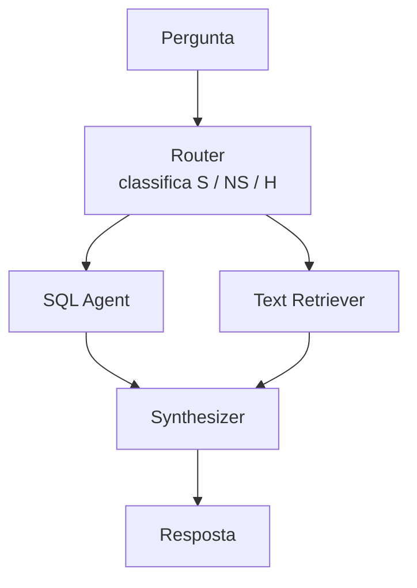

# PoC — Prova de Conceito (v0)

**Estado:** arquivada. Esta pasta preserva o protótipo inicial da arquitetura multiagente, correspondente à Prova de Conceito descrita no Capítulo 4 do projeto de qualificação. Para o pipeline completo e instrumentado usado na dissertação, ver [`../experimentos`](../experimentos).

## O que é isto

Primeira implementação exploratória do sistema, construída para validar a viabilidade de um pipeline multiagente RAG sobre dados híbridos antes da reimplementação completa. O estudo preliminar respondeu à pergunta: _"É viável combinar busca em bases estruturadas (SQL) e não estruturadas (documentos) em uma cadeia orquestrada por LLM, capaz de decidir autonomamente a fonte adequada?"_

A PoC responde **sim** e, por isso, existe — mas foi concebida para validação técnica, não para servir como baseline experimental rigoroso da versão final.

## Cenário da PoC

Conforme descrito no Capítulo 4 do projeto, a PoC foi conduzida no domínio da cadeia produtiva do açaí na Amazônia, selecionado pela proximidade com o contexto do projeto AmazonIA / AGROBIOFOR. A base de conhecimento combinou:

- **Dados estruturados** (SQLite): tabelas censitárias do IBGE (PAM 2016, LSPA 2024, PEVS 2016) cobrindo produção agrícola, extração vegetal e estimativas de safra.
- **Documentos não estruturados** (vetorizados em ChromaDB): relatórios técnicos sobre a cadeia do açaí (OIT/2024, Sebrae/2024, IPAM/2018).

O conjunto de validação foi composto por **15 consultas** distribuídas em três categorias (5 S, 5 NS, 5 H). A avaliação empregou a abordagem LLM-as-a-Judge.

## Arquitetura

Cadeia LangGraph reduzida, sem os módulos Verifier e Consolidator:



### Diferenças em relação à implementação final (`experimentos/`)

| Aspecto | PoC | Final |
|---|---|---|
| Decisão de rota | Router classificador (S/NS/H) | Planner com decomposição explícita em sub-tarefas |
| Nós do grafo | Router → SQL/Text → Synthesizer | Planner → SQL/Text → Synthesizer → Verifier → Consolidator |
| Retry de SQL | Sem retry em caso de erro de execução | Retry automático guiado pelo erro do SQLite |
| Citações | Ausentes ou genéricas | Citação explícita por sentença |
| Verificação semântica | Ausente | Verifier baseado em RARR (reescrita ou busca complementar) |
| Ablação | Modo único | Quatro modos (`full`, `no-verifier`, `no-synthesizer`, `poc`) |
| Avaliação | Script monolítico, métricas pontuais | Suíte com três juízes LLM |
| Config | Hard-coded e `.env` simples | `pydantic-settings` com override por nó |

## Papel no trabalho

A PoC cumpre dois papéis:

1. **Argumento de viabilidade** — demonstra que o problema é tratável com cadeia multiagente e justifica o esforço de construir a versão instrumentada. Principais achados (ver §4.5 do projeto de qualificação):
   - Acurácia de roteamento: 80% geral, 100% em consultas homogêneas (S e NS), apenas 40% em híbridas (H).
   - Precision/Recall do RAG em NS: ~0,9 / ~0,9.
   - Latência média: ~36 s por consulta; consumo: ~8,6k tokens entrada / ~2,3k saída.
   - Principais gargalos identificados: decisão binária insuficiente para consultas híbridas, ausência de verificação semântica e ausência de feedback loop no SQL Agent.

2. **Inspiração para a arquitetura "Simples"** — o modo de ablação `poc` em `experimentos/` é uma reimplementação enxuta baseada nesta PoC, com as duas melhorias mínimas observadas como essenciais durante o desenvolvimento (retry de SQL e padrão de citações), construída dentro do mesmo framework de avaliação.

> ⚠️ Importante: a arquitetura `poc` de `experimentos/` **não é** esta PoC. É uma reimplementação a partir dos mesmos princípios, dentro da mesma instrumentação do restante do repositório, para permitir comparação justa com os demais modos de ablação.

## Rodar a PoC

Esta pasta é preservada apenas para referência. Para reproduzir:

```bash
cd poc
uv sync
# copiar artefatos do dataset (dados.db, YAMLs, evaluation.json, relatórios PDF, chroma_db)
# para poc/data/ — ver README principal do repositório e do dataset repo
uv run python 1_setup_chromadb.py         # popula ChromaDB
uv run python 3_run_evaluation.py         # executa avaliação
```

Os scripts numerados (`1_*.py`, `3_*.py`) indicam a ordem de execução esperada.

## Status e manutenção

- **Sem desenvolvimento ativo.** Mudanças futuras não ocorrerão.
- Para qualquer experimento novo, usar [`../experimentos`](../experimentos).
